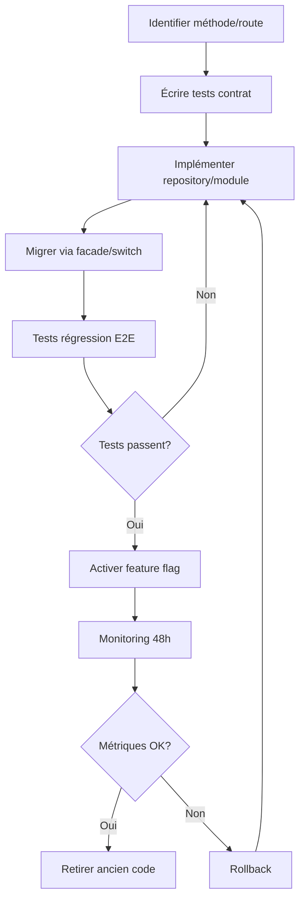

# 🏗️ Roadmap d'Optimisation Architecture Saxium

> **Dernière mise à jour** : 29 Octobre 2025  
> **Objectif** : Décomposer les monolithes storage-poc.ts (8,758 LOC) et routes-poc.ts (11,998 LOC) pour améliorer maintenabilité, testabilité et performance

## 📊 État Actuel de l'Architecture

### Fichiers Monolithiques Critiques

| Fichier | Lignes | Méthodes/Routes | Impact | Priorité |
|---------|--------|-----------------|--------|----------|
| `storage-poc.ts` | 8,758 | 120+ méthodes | 🔴 CRITIQUE | HIGH |
| `routes-poc.ts` | 11,998 | 200+ routes | 🔴 CRITIQUE | HIGH |
| `routes-index.ts` | 233 | 30+ routes | 🟡 MEDIUM | MEDIUM |

### Services (35+ fichiers)

**Duplication détectée** :
- Monday.com : 8 services (`MondayService`, `MondayImportService`, `MondayExportService`, `MondayProductionFinalService`, etc.)
- Analytics : 3 services (`AnalyticsService`, `PerformanceMetricsService`, `PredictiveEngineService`)
- Intelligence : 4 services (`DateIntelligenceService`, `AIService`, `ContextBuilderService`, `ChatbotOrchestrationService`)

### Architecture Cible

```
server/
├── storage/
│   ├── commercial/          ✅ AoRepository, OfferRepository
│   ├── analytics/           ✅ KpiRepository
│   ├── production/          ⏳ À créer
│   ├── suppliers/           ⏳ À créer
│   ├── projects/            ⏳ À créer
│   └── facade/              ✅ StorageFacade (pont vers legacy)
├── modules/
│   ├── chiffrage/           ✅ Routes modulaires
│   ├── analytics/           ✅ Routes modulaires
│   ├── documents/           ✅ Routes modulaires (récemment nettoyé)
│   ├── commercial/          ⏳ À migrer depuis routes-poc
│   └── production/          ⏳ À migrer depuis routes-poc
└── services/
    ├── integration/         ⏳ Regrouper Monday* services
    ├── intelligence/        ⏳ Regrouper AI services
    └── monitoring/          ⏳ Regrouper analytics services
```

---

## 🎯 Priorités et Objectifs

### HIGH Priority - Décomposition Storage

**Objectif** : Réduire storage-poc.ts de ≥60% (5,000 LOC vers repositories)

#### Phase 1 : Inventaire et Matrice (1 semaine)

1. **Cataloguer toutes les méthodes storage-poc.ts**
   ```bash
   grep "async [a-zA-Z]*(" server/storage-poc.ts | wc -l
   # Résultat : 120+ méthodes
   ```

2. **Classifier par domaine métier**
   - 🏢 **Commercial** : AO, Offers, Contacts (30-40 méthodes)
   - 📊 **Analytics** : KPIs, Metrics, Snapshots (15-20 méthodes)
   - 🏗️ **Production** : Projects, Tasks, Planning (25-30 méthodes)
   - 📦 **Suppliers** : Suppliers, Quotes, Documents (20-25 méthodes)
   - 📅 **Intelligence** : DateAlerts, Rules, Validation (15-20 méthodes)
   - 👥 **Admin** : Users, Teams, Permissions (10-15 méthodes)

3. **Matrice de migration storage**

| Méthode | Domaine | Repository Cible | Difficulté | Tests | Statut |
|---------|---------|------------------|------------|-------|--------|
| `getAos()` | Commercial | AoRepository | ⭐ Facile | ✅ | Migré |
| `getAo(id)` | Commercial | AoRepository | ⭐ Facile | ✅ | Migré |
| `createAo()` | Commercial | AoRepository | ⭐⭐ Moyen | ✅ | Migré |
| `getOffers()` | Commercial | OfferRepository | ⭐ Facile | ✅ | Migré |
| `getOffer(id)` | Commercial | OfferRepository | ⭐ Facile | ✅ | Migré |
| `createOffer()` | Commercial | OfferRepository | ⭐⭐ Moyen | ✅ | Migré |
| `getProjects()` | Production | ProjectRepository | ⭐ Facile | ⏳ | TODO |
| `getProject(id)` | Production | ProjectRepository | ⭐ Facile | ⏳ | TODO |
| `createProject()` | Production | ProjectRepository | ⭐⭐⭐ Difficile | ⏳ | TODO |
| `getKPIs()` | Analytics | KpiRepository | ⭐ Facile | ✅ | Migré |
| `getDateAlerts()` | Intelligence | DateAlertRepository | ⭐⭐ Moyen | ⏳ | TODO |
| ... | ... | ... | ... | ... | ... |

#### Phase 2 : Implémentation Progressive (4-6 semaines)

**Semaine 1-2 : Commercial (AOs/Offers)**
- ✅ `AoRepository` : Déjà implémenté
- ✅ `OfferRepository` : Déjà implémenté
- ⏳ Migrer 15 méthodes restantes (contacts, lots, etc.)
- ⏳ Tests de contrat : `storage/__tests__/commercial.contract.test.ts`

**Semaine 3-4 : Production (Projects/Tasks)**
- ⏳ Créer `ProjectRepository`
- ⏳ Créer `TaskRepository`
- ⏳ Migrer 25-30 méthodes
- ⏳ Tests de contrat

**Semaine 5-6 : Suppliers + Intelligence**
- ⏳ Créer `SupplierRepository`
- ⏳ Créer `DateAlertRepository`
- ⏳ Migrer méthodes restantes

#### Phase 3 : Activation et Validation (1-2 semaines)

1. **Activer StorageFacade dans bootstrap**
   ```typescript
   // server/index.ts
   import { storageFacade } from './storage/facade/StorageFacade';
   app.set('storage', storageFacade); // Au lieu de storage-poc
   ```

2. **Tests de régression**
   - ✅ Exécuter tous les tests backend
   - ✅ Exécuter tests E2E Playwright
   - ✅ Monitorer métriques performance (latence queries)

3. **Feature flags pour rollback**
   ```typescript
   const USE_NEW_REPOSITORIES = process.env.USE_NEW_REPOSITORIES === 'true';
   ```

**Métriques de succès** :
- ✅ storage-poc.ts : 8,758 LOC → <3,500 LOC (-60%)
- ✅ Couverture tests repositories : ≥80%
- ✅ Latence queries : maintenue ou améliorée
- ✅ Zéro regression fonctionnelle

---

### HIGH Priority - Consolidation Routes

**Objectif** : Réduire routes-poc.ts de ≥70% (8,000 LOC vers modules)

#### Phase 1 : Audit Routes (1 semaine)

1. **Inventaire routes-poc.ts**
   ```bash
   grep -E "(router\.get|router\.post|router\.put|router\.patch|router\.delete)" server/routes-poc.ts | wc -l
   # Résultat : ~200 routes
   ```

2. **Classification par domaine**
   - 🏢 **Commercial** : `/api/aos/*`, `/api/offers/*` (40-50 routes)
   - 📦 **Suppliers** : `/api/suppliers/*`, `/api/supplier-requests/*` (30-40 routes)
   - 🏗️ **Projects** : `/api/projects/*`, `/api/tasks/*` (30-40 routes)
   - 📅 **DateIntelligence** : `/api/date-alerts/*`, `/api/rules/*` (20-25 routes)
   - 📊 **Analytics** : Déjà migré vers `modules/analytics` ✅
   - 📄 **Documents** : Déjà migré vers `modules/documents` ✅

3. **Matrice de migration routes**

| Route | Domaine | Module Cible | Méthode Storage | Difficulté | Statut |
|-------|---------|--------------|-----------------|------------|--------|
| `GET /api/aos` | Commercial | modules/commercial | `getAos()` | ⭐ | TODO |
| `GET /api/aos/:id` | Commercial | modules/commercial | `getAo(id)` | ⭐ | TODO |
| `POST /api/aos` | Commercial | modules/commercial | `createAo()` | ⭐⭐ | TODO |
| `GET /api/offers` | Commercial | modules/commercial | `getOffers()` | ⭐ | TODO |
| `GET /api/projects` | Projects | modules/projects | `getProjects()` | ⭐ | TODO |
| `GET /api/analytics/*` | Analytics | modules/analytics | Divers | ⭐ | ✅ Migré |
| `POST /api/ocr/*` | Documents | modules/documents | Divers | ⭐⭐ | ✅ Migré |
| ... | ... | ... | ... | ... | ... |

#### Phase 2 : Migration Progressive (4-6 semaines)

**Pattern de migration recommandé** :

```typescript
// AVANT (routes-poc.ts)
router.get('/api/aos', async (req, res) => {
  const aos = await storage.getAos();
  res.json({ success: true, data: aos });
});

// APRÈS (modules/commercial/routes.ts)
import { asyncHandler } from '../../utils/error-handler';
import { logger } from '../../utils/logger';

router.get('/api/aos', asyncHandler(async (req, res) => {
  const storage = req.app.get('storage');
  const aos = await storage.getAos();
  
  logger.info('AOs récupérés', { 
    metadata: { count: aos.length } 
  });
  
  res.json({ success: true, data: aos });
}));
```

**Semaine 1-2 : Module Commercial**
- ⏳ Créer `server/modules/commercial/routes.ts`
- ⏳ Migrer 40-50 routes AOs/Offers
- ⏳ Validation tests E2E

**Semaine 3-4 : Module Production**
- ⏳ Créer `server/modules/production/routes.ts`
- ⏳ Migrer 30-40 routes Projects/Tasks
- ⏳ Validation tests E2E

**Semaine 5-6 : Autres modules**
- ⏳ Module DateIntelligence
- ⏳ Module Admin
- ⏳ Routes restantes

#### Phase 3 : Switch Bootstrap (1 semaine)

1. **Activer routes modulaires**
   ```typescript
   // server/routes.ts
   import { registerModularRoutes } from './routes-index';
   
   export async function registerRoutes(app: Express) {
     // Priorité aux routes modulaires
     await registerModularRoutes(app);
     
     // Legacy routes en fallback (DEPRECATED)
     // await registerPocRoutes(app); // Commenter progressivement
   }
   ```

2. **Feature flag pour migration progressive**
   ```typescript
   const USE_MODULAR_ROUTES = process.env.USE_MODULAR_ROUTES === 'true';
   ```

3. **Validation et monitoring**
   - ✅ Tests régression
   - ✅ Monitoring latence endpoints
   - ✅ Logs erreurs

**Métriques de succès** :
- ✅ routes-poc.ts : 11,998 LOC → <3,500 LOC (-70%)
- ✅ Temps onboarding nouvelle route : 2 jours → <1 jour
- ✅ Zéro downtime pendant migration

---

### MEDIUM Priority - Convergence Services

**Objectif** : Réduire duplication et couplage entre 35+ services

#### Analyse Duplication

**Services Monday.com (8 fichiers)** :
- `MondayService.ts` : API client de base
- `MondayImportService.ts` : Import données
- `MondayExportService.ts` : Export données
- `MondayProductionFinalService.ts` : Production workflow
- `MondayMigrationService.ts` : Migration historique
- `MondaySchemaAnalyzer.ts` : Analyse schema
- `MondayWebhookService.ts` : Webhooks
- `MondayDataSplitter.ts` : Parsing données

**Proposition consolidation** :
```
services/integration/
├── monday/
│   ├── MondayClient.ts          # API client (merge MondayService)
│   ├── MondayDataService.ts     # Import/Export/Transform
│   ├── MondayWebhookHandler.ts  # Webhooks
│   └── MondayMigration.ts       # Migration (legacy)
```

**Services Analytics (5 fichiers)** :
- `AnalyticsService.ts` : Calculs KPIs
- `PerformanceMetricsService.ts` : Métriques performance
- `PredictiveEngineService.ts` : Prédictions
- `BusinessContextService.ts` : Contexte business
- `ContextBuilderService.ts` : Construction contexte

**Proposition consolidation** :
```
services/intelligence/
├── AnalyticsEngine.ts      # KPIs + Metrics
├── PredictiveEngine.ts     # Prédictions
└── ContextBuilder.ts       # Contexte (merge 2 services)
```

#### Plan d'Action

1. **Semaine 1-2 : Audit dependencies**
   - ⏳ Créer graphe de dépendances services
   - ⏳ Identifier méthodes dupliquées
   - ⏳ Mesurer couplage (imports croisés)

2. **Semaine 3-4 : Extraction utilitaires**
   - ⏳ Créer `services/shared/retry.ts` (extraction RetryService)
   - ⏳ Créer `services/shared/cache.ts` (extraction CacheService)
   - ⏳ Créer `services/shared/logging.ts` (patterns logging)

3. **Semaine 5-8 : Consolidation progressive**
   - ⏳ Merger Monday services
   - ⏳ Merger Analytics services
   - ⏳ Tests de non-régression

**Métriques de succès** :
- ✅ Réduction : 35 services → <25 services (-30%)
- ✅ Duplication code : -40%
- ✅ Imports croisés : -50%

---

### MEDIUM Priority - Observabilité et Standards

#### Logger Structuré

**État actuel** :
- ✅ Logger structuré disponible (`utils/logger.ts`)
- ❌ console.log encore présent dans 30+ fichiers
- ⏳ Documentation patterns disponible (README-UTILS.md)

**Plan d'action** :

1. **ESLint rule enforcement**
   ```json
   {
     "rules": {
       "no-console": ["error", { "allow": [] }]
     }
   }
   ```

2. **Migration progressive**
   ```bash
   # Script automatique
   find server -name "*.ts" -exec sed -i 's/console.log/logger.info/g' {} \;
   find server -name "*.ts" -exec sed -i 's/console.error/logger.error/g' {} \;
   ```

3. **Patterns requis**
   ```typescript
   // Remplacer console.log
   logger.info('Message', { metadata: { ... } });
   
   // Remplacer console.error
   logger.error('Erreur', error, { metadata: { ... } });
   
   // Timing
   const endTimer = logger.time('Operation');
   // ... code
   endTimer();
   ```

#### Error Handling Standards

**État actuel** :
- ✅ Erreurs typées disponibles (`utils/error-handler.ts`)
- ✅ asyncHandler disponible
- ⏳ Migration partielle (routes AI migrées ✅)
- ❌ `throw new Error()` encore présent

**Plan d'action** :

1. **Utiliser asyncHandler partout**
   ```typescript
   // AVANT
   router.post('/api/endpoint', async (req, res) => {
     try {
       const result = await operation();
       res.json({ success: true, data: result });
     } catch (error) {
       console.error(error);
       res.status(500).json({ error: 'Internal error' });
     }
   });
   
   // APRÈS
   router.post('/api/endpoint', asyncHandler(async (req, res) => {
     const result = await operation();
     res.json({ success: true, data: result });
   }));
   ```

2. **Erreurs typées**
   ```typescript
   // Remplacer throw new Error()
   throw new NotFoundError('Projet');
   throw new ValidationError('Données invalides', { email: ['Format invalide'] });
   ```

**Métriques de succès** :
- ✅ console.log : 0 occurrences dans server/
- ✅ asyncHandler : 100% routes
- ✅ Erreurs typées : ≥80% throw statements

---

### LOW Priority - Performance Hygiene

#### Caching Strategy

**État actuel** :
- ✅ CacheService disponible (Redis-ready)
- ✅ MemoryCacheAdapter actif en dev
- ⏳ Utilisé partiellement (Monday boards, analytics)
- ❌ Nombreuses queries non cachées

**Opportunités** :

1. **Queries haute fréquence**
   - `getAos()` : Hit rate potentiel 70%
   - `getOffers()` : Hit rate potentiel 65%
   - `getProjects()` : Hit rate potentiel 60%

2. **Implementation pattern**
   ```typescript
   async getAos(): Promise<Ao[]> {
     const cacheKey = 'aos:all';
     const cached = await cacheService.get<Ao[]>(cacheKey);
     if (cached) return cached;
     
     const aos = await db.select().from(aosTable);
     await cacheService.set(cacheKey, aos, 600); // 10 min TTL
     return aos;
   }
   ```

3. **Invalidation events**
   ```typescript
   eventBus.on('ao:created', () => cacheService.invalidate('aos:*'));
   eventBus.on('ao:updated', ({ id }) => cacheService.invalidate(`ao:${id}`));
   ```

#### N+1 Query Detection

**Méthode d'analyse** :
```bash
# Chercher patterns suspects
grep -n "for.*await" server/storage-poc.ts
grep -n "map.*await" server/storage-poc.ts
```

**Candidats à optimiser** :
- `getProjectsWithTasks()` : N+1 sur tasks
- `getOffersWithChiffrage()` : N+1 sur chiffrage elements
- `getAosWithLots()` : N+1 sur lots

**Pattern optimisation** :
```typescript
// AVANT (N+1)
const projects = await getProjects();
for (const project of projects) {
  project.tasks = await getTasks(project.id); // N queries
}

// APRÈS (1 query)
const projects = await db
  .select()
  .from(projectsTable)
  .leftJoin(tasksTable, eq(tasksTable.projectId, projectsTable.id));
```

**Métriques de succès** :
- ✅ Réduction queries : -30%
- ✅ Latence p95 top 3 endpoints : <300ms
- ✅ Hit rate cache : ≥50%

---

## 📅 Timeline Globale

### Trimestre 1 (Octobre - Décembre 2025)

**Mois 1 : Fondations**
- ✅ Audit architecture (Semaine 1)
- ⏳ Matrice migration storage (Semaine 2)
- ⏳ Matrice migration routes (Semaine 3)
- ⏳ Tests contrat repositories (Semaine 4)

**Mois 2 : Migration Storage**
- ⏳ Commercial repositories (Semaines 5-6)
- ⏳ Production repositories (Semaines 7-8)

**Mois 3 : Migration Routes**
- ⏳ Commercial routes (Semaines 9-10)
- ⏳ Production routes (Semaines 11-12)
- ⏳ Switch bootstrap (Semaine 13)

### Trimestre 2 (Janvier - Mars 2026)

**Mois 4 : Consolidation Services**
- ⏳ Monday services (Semaines 14-15)
- ⏳ Analytics services (Semaines 16-17)

**Mois 5 : Standards et Qualité**
- ⏳ Migration logger (Semaine 18)
- ⏳ Migration error handlers (Semaine 19-20)
- ⏳ ESLint rules enforcement (Semaine 21)

**Mois 6 : Performance**
- ⏳ Cache implementation (Semaines 22-23)
- ⏳ N+1 query fixes (Semaines 24-25)
- ⏳ Monitoring et observabilité (Semaine 26)

---

## 🎯 Métriques de Succès Globales

### Code Quality

| Métrique | Avant | Cible | Progression |
|----------|-------|-------|-------------|
| storage-poc.ts LOC | 8,758 | <3,500 | 0% |
| routes-poc.ts LOC | 11,998 | <3,500 | 0% |
| Nombre de services | 35+ | <25 | 0% |
| Console.log count | 100+ | 0 | 0% |
| Couverture tests | ~60% | ≥80% | 0% |

### Performance

| Métrique | Avant | Cible | Progression |
|----------|-------|-------|-------------|
| Latence p95 analytics | ~800ms | <300ms | 0% |
| Cache hit rate | 0% | ≥50% | 0% |
| N+1 queries | 15+ | 0 | 0% |

### Developer Experience

| Métrique | Avant | Cible | Progression |
|----------|-------|-------|-------------|
| Temps onboard route | 2 jours | <1 jour | 0% |
| LSP errors | 14 | <5 | 0% |
| Build time | ~30s | <20s | 0% |

---

## 🔄 Process de Migration

### Workflow Standard



### Checklist par Migration

- [ ] Tests unitaires écrits
- [ ] Tests contrat validés
- [ ] Documentation mise à jour
- [ ] Feature flag créé
- [ ] Monitoring configuré
- [ ] Tests E2E passés
- [ ] Review code approuvée
- [ ] Déployé en staging
- [ ] Validation 48h production
- [ ] Ancien code retiré

---

## 📚 Documentation

### Guides à Créer

1. **Architecture Decision Records (ADRs)**
   - ⏳ ADR-001 : Migration storage-poc → repositories
   - ⏳ ADR-002 : Migration routes-poc → modules
   - ⏳ ADR-003 : Consolidation services

2. **Developer Guidelines**
   - ⏳ Comment ajouter un nouveau repository
   - ⏳ Comment ajouter une nouvelle route modulaire
   - ⏳ Patterns logging et error handling
   - ⏳ Testing strategy

3. **Migration Guides**
   - ⏳ Guide migration storage method
   - ⏳ Guide migration route
   - ⏳ Guide consolidation service

---

## 🚀 Quick Wins Immédiats

### Semaine 1 (Cette semaine)

1. **Activer StorageFacade dans bootstrap** (2h)
   - Modifier `server/index.ts`
   - Tests régression
   - Monitoring

2. **Créer module commercial** (4h)
   - Créer `server/modules/commercial/`
   - Migrer 5 routes AO critiques
   - Tests E2E

3. **ESLint rule console.log** (1h)
   - Ajouter rule
   - Fix auto 50% des occurrences

**Impact attendu** :
- ✅ Architecture modulaire validée
- ✅ Pattern migration établi
- ✅ Quick win console.log (-50%)

---

## 📞 Contact et Support

**Responsable Architecture** : Équipe DevOps Saxium  
**Documentation** : `/docs/ARCHITECTURE_OPTIMIZATION_ROADMAP.md`  
**Issues** : GitHub Issues avec tag `architecture-optimization`

---

**Légende** :
- ✅ Complété
- ⏳ En cours / Planifié
- ❌ À faire
- 🔴 Critique
- 🟡 Important
- 🟢 Optionnel
