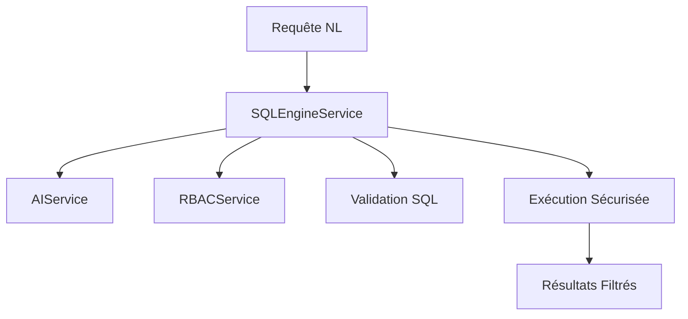

# Documentation Moteur SQL Sécurisé Saxium

## Vue d'ensemble

Le moteur SQL sécurisé Saxium transforme les requêtes en langage naturel en SQL sécurisé avec contrôle d'accès RBAC automatique pour l'entreprise de menuiserie.

## Architecture



## API Routes

### POST /api/sql/query
Exécute une requête en langage naturel

**Requête:**
```json
{
  "naturalLanguageQuery": "Quels sont mes projets en retard ?",
  "context": "Entreprise menuiserie JLM",
  "dryRun": false,
  "maxResults": 100,
  "timeoutMs": 30000
}
```

**Réponse:**
```json
{
  "success": true,
  "data": {
    "sql": "SELECT p.name, p.endDate FROM projects p WHERE p.responsibleUserId = $1 AND p.endDate < NOW()",
    "parameters": ["chef-001"],
    "results": [...],
    "executionTime": 1250,
    "rbacFiltersApplied": ["Filtre utilisateur sur projects"],
    "confidence": 0.95,
    "metadata": {
      "tablesAccessed": ["projects"],
      "aiModelUsed": "claude-sonnet-4",
      "cacheHit": false
    }
  }
}
```

### POST /api/sql/validate
Valide un SQL sans l'exécuter

**Requête:**
```json
{
  "sql": "SELECT * FROM projects WHERE id = $1",
  "parameters": ["proj-001"]
}
```

**Réponse:**
```json
{
  "success": true,
  "data": {
    "isValid": true,
    "isSecure": true,
    "allowedTables": ["projects"],
    "deniedTables": [],
    "securityViolations": [],
    "rbacViolations": []
  }
}
```

### GET /api/sql/context
Récupère le contexte de base de données disponible

**Réponse:**
```json
{
  "success": true,
  "data": {
    "context": "Base de données menuiserie avec tables: projects, offers, users...",
    "availableTables": ["projects", "offers", "project_tasks"],
    "rbacFiltersInfo": "Accès filtré par utilisateur responsable",
    "exampleQueries": [
      "Mes projets en cours",
      "Budget consommé par projet"
    ]
  }
}
```

## Exemples d'usage par rôle

### Chef de Projet
```javascript
// Requêtes typiques
"Quels sont mes projets en retard ?"
"Combien de fenêtres PVC sont en production ?"
"Budget restant sur le projet Mairie ?"
"Livraisons prévues cette semaine ?"

// SQL généré (filtré automatiquement)
SELECT p.name, p.endDate 
FROM projects p 
WHERE p.responsibleUserId = $1 
AND p.endDate < NOW()
```

### Administrateur
```javascript
// Requêtes analytics
"Analyse de rentabilité par matériau"
"Évolution CA par mois"
"Projets avec dépassement budget > 10%"

// SQL complexe autorisé
SELECT 
  m.type, 
  AVG(p.profitMargin) as avg_margin,
  COUNT(*) as project_count
FROM projects p 
JOIN materials m ON p.id = m.projectId 
GROUP BY m.type
```

### Utilisateur Standard
```javascript
// Accès limité aux données personnelles
"Mes tâches du jour"
"Mes heures cette semaine"

// Fortement filtré par RBAC
SELECT t.name, t.deadline 
FROM project_tasks t 
WHERE t.assignedUserId = $1 
AND t.status = 'active'
```

## Sécurité

### Protection Anti-Injection
- ✅ Blocage DROP/DELETE/UPDATE/INSERT
- ✅ Validation AST SQL
- ✅ Détection patterns malveillants
- ✅ Paramètres échappés

### Contrôle RBAC
- ✅ Filtrage automatique par utilisateur
- ✅ Masquage colonnes sensibles
- ✅ Restriction accès par table
- ✅ Audit des accès

### Limites Performance
- ✅ Timeout max 60s
- ✅ Résultats max 10,000 lignes
- ✅ Rate limiting API
- ✅ Cache intelligent

## Monitoring

### Métriques Collectées
- Temps d'exécution par requête
- Taux de succès/échec
- Utilisation IA (tokens, coût)
- Violations sécurité tentées
- Performance RBAC

### Logs de Sécurité
```javascript
// Tentative injection bloquée
{
  "event": "security_violation",
  "user": "user-001",
  "query": "'; DROP TABLE users; --",
  "violation_type": "sql_injection",
  "blocked": true
}

// Accès RBAC refusé
{
  "event": "rbac_denial", 
  "user": "chef-001",
  "table": "users",
  "reason": "insufficient_permissions"
}
```

## Intégration

### Dans le Frontend
```typescript
import { useQuery } from '@tanstack/react-query';

function useNaturalLanguageQuery(query: string) {
  return useQuery({
    queryKey: ['sql-query', query],
    queryFn: async () => {
      const response = await fetch('/api/sql/query', {
        method: 'POST',
        headers: { 'Content-Type': 'application/json' },
        body: JSON.stringify({
          naturalLanguageQuery: query,
          context: "Interface de gestion projets menuiserie"
        })
      });
      return response.json();
    }
  });
}
```

### Dans un Service
```typescript
import { SQLEngineService } from './services/SQLEngineService';

class BusinessIntelligenceService {
  constructor(private sqlEngine: SQLEngineService) {}

  async getProjectAnalytics(userId: string, userRole: string) {
    const result = await this.sqlEngine.executeNaturalLanguageQuery({
      naturalLanguageQuery: "Analyse performance projets derniers 6 mois",
      userId,
      userRole,
      context: "Dashboard dirigeant menuiserie"
    });
    
    return result.success ? result.results : [];
  }
}
```

## Bonnes Pratiques

### Formulation des Requêtes
✅ **Bon:** "Mes projets fenêtres en retard ce mois"
❌ **Éviter:** "SELECT * FROM projects WHERE..."

✅ **Bon:** "Budget moyen par type de menuiserie" 
❌ **Éviter:** Requêtes trop vagues

### Gestion des Erreurs
```typescript
const result = await sqlEngine.executeNaturalLanguageQuery(request);

if (!result.success) {
  switch (result.error?.type) {
    case 'rbac':
      // Utilisateur non autorisé
      showAccessDeniedMessage();
      break;
    case 'security':
      // Tentative malveillante détectée
      logSecurityIncident(result.error);
      break;
    case 'validation':
      // Requête mal formée
      showValidationError(result.error.message);
      break;
  }
}
```

## Maintenance

### Mise à jour Contexte IA
Le contexte est automatically mis à jour avec:
- Nouveaux schémas de base de données
- Exemples de requêtes métier
- Règles business spécifiques menuiserie

### Monitoring Performance
- Surveiller temps de réponse < 5s
- Vérifier taux succès > 95%
- Contrôler coûts IA (tokens utilisés)

---

**Moteur SQL Saxium v1.0** - Sécurisé pour production menuiserie 🔒